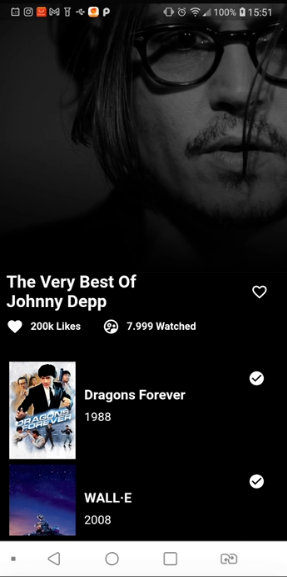

<h1>Resolucao do desafio técnico para o processo seletivo da empresa Startaideia.</h1>


## 👋Seja bem-vindo ao meu desafio tecnico!
 - eu detalhei todos passos com carinho para voce entender meu codigo.

### Layout espectativa

 
 

### Layout desenvolvido

 


<h2>APK do projeto</h2>

[APK](https://drive.google.com/file/d/1NjCxEEjiklDCbIwM9bynJxRvEwA4cFFg/view?usp=sharing)

## Historia do projeto (branchs)

- [MAIN](https://github.com/devtvas/flutter_challenge_startaideia/tree/main) - 18/10/22 
- [SAI-02]() - 19/10/22 
- [SAI-03]() - 20/10/22 


<h2>Como rodar o projeto</h2>

  + Commands

    ```
    $ git clone projeto
    $ cd nome-projeto
    $ flutter build run
    ```
    
<h2>Regras do desafio</h2>

1. Usar Clean architecture.
2. Usar algum package de gerenciamento de estado, como: Getx, Bloc, MobX, Provider etc.
3. As informações do filme devem vir do endpoint /movie.
4. Usar o "vote_count" que é retornado pelo endpoint acima para representar o número de likes.
5. Substituir o texto "3 of 10 watched" (ver tela de exemplo no tópico "Layout") por "<popularity>
view". O "popularity" a ser usado é o campo retornado pelo endpoint /movie. Mantenha o ícone
que já está na tela de exemplo.
6. O ícone de like (coração) deve mudar quando clicado, alternando entre preenchido e vazio.
7. Deve haver uma lista de filmes abaixo dos detalhes.
8. O projeto deve ser disponibilizado em um repositório aberto no GitHub. Envie a URL assim que
possível.


<h2>Objetivo do desafio</h2>

Você deve replicar o [layout da tela de detalhe](https://apps.apple.com/br/app/todomovies-4/id792499896) dos filmes do app [TodoMovies4](https://apps.apple.com/br/app/todomovies-4/id792499896)
Se você reparar, a imagem do filme possui um efeito. Não é obrigatório implementar este efeito, mas se for feito
nós ficaremos felizes :)

### A referencia dessa jornada pode ser encontrado neste [link](https://apps.apple.com/br/app/todomovies-4/id792499896). Em geral o fluxo que deve ser feito, se resume nos seguintes passos:
1. A lista de filmes abaixo do detalhe do filme pode ser o retorno do endpoint
[/movie/{movie_id}/similar](https://developers.themoviedb.org/3/movies/get-similar-movies).
2. Para fazer as requisições HTTP pode ser usado o package Dio.
3. Testes são sempre bem vindos.
4. Vamos olhar tudo, inclusive commits, branches, organização de pastas, etc.
5. Um código limpo e organizado pode ser mais importante do que o app todo pronto.
6. Vamos ler o seu README, caso você queira deixar alguma mensagem para nós.


###  Base de Dados
 
* Utilizado dados mockados

<h2>Detalhes de Configuracao</h2>
  
  + Flutter channel: stable 
  + Flutter: versao 2.10.1
  + Dart: versao 2.16.1
  + Design Pattern: MODULAR
  + Dependencias Utilizadas:  
    
    - get
   


## Suporte
Caso tenha dificuldades em entender o teste ou tenha alguma dúvida, por favor, entrar em contato pelo: [email](diogenes.silva@startaideia.com.br).

## Candidato/Desenvolvedor

Feito com 💜 por [@devtvas](https://www.linkedin.com/in/devtvas/).
